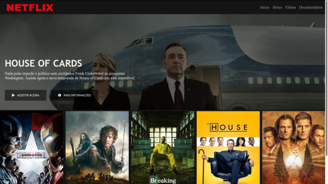

# Projeto: netflix-html_css_js

## INFORMAÇÕES
Aula Front-end de HTML5, CSS3 e JavaScript do [Felipe Aguiar](https://github.com/felipeAguiarCode), na [Digital Innovation One](https://web.digitalinnovation.one) “Recriando a Interface do Netflix”.

Aprendi como estruturar um layout, técnicas de CSS3 com containers e variáveis, como posicionar os elementos com Flexbox, como utilizar plugins Jquery e como utilizar ícones do Font Awesome.

### TECNOLOGIAS UTILIZADAS: 
* CSS3
* HTML5
* JAVASCRIPT
* JQuery plugin - Owl Carousel 2
* Font Awesome

### SCREENSHOT:

### DISPONÍVEL EM: [https://dagriel.github.io/netflix](https://dagriel.github.io/netflix)
